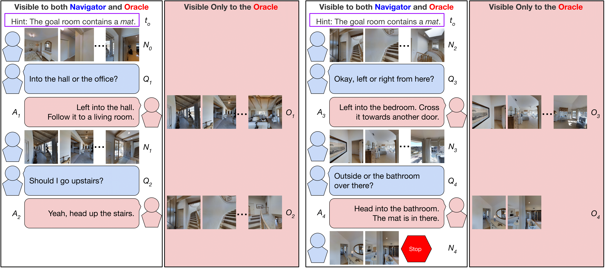

# Vision-and-Dialog Navigation
This repository contains code for the paper **Vision-and-Dialog Navigation**, submitted to the 3rd Conference on Robot Learning (CoRL 2019).

<p align="center">
<a href="https://www.youtube.com/watch?v=_SCE9e2S-HI" target="_blank"></a>
</p>


## Cooperative Vision-and-Dialog Navigation (CVDN) Dataset



A dataset of embodied, human-human dialogs situated in a simulated, photorealistic home environment.  The _Navigator_ asks questions of their partner, the _Oracle_, who has privileged access to the best next steps the _Navigator_ should take according to a full-state information shortest path planner. The dataset consists of 2050 human-human navigation dialogs, comprising over 7k navigation trajectories punctuated by question-answer exchanges, across 83 houses.


## Navigation from Dialog History (NDH) Task


The repository includes the training data and evaluation metrics for the Navigation from Dialog History (NDH) task, where an autonomous agent, given a target object and a dialog history between humans cooperating to find that object, must infer navigation actions towards the goal in unexplored environments.

## Installation / Build Instructions

This repository is built from the [Matterport3DSimulator](https://github.com/peteanderson80/Matterport3DSimulator) codebase. The original installation instructions are included at [`README_Matterport3DSimulator.md`](README_Matterport3DSimulator.md). In this document we outline the instructions necessary to work with the NDH task.

We recommend using the mattersim [Dockerfile](Dockerfile) to install the simulator. The simulator can also be [built without docker](https://github.com/peteanderson80/Matterport3DSimulator#building-without-docker) but satisfying the project dependencies may be more difficult.

### Prerequisites

- Ubuntu 16.04
- Nvidia GPU with driver >= 384
- Install [docker](https://docs.docker.com/engine/installation/)
- Install [nvidia-docker2.0](https://github.com/nvidia/nvidia-docker/wiki/Installation-(version-2.0))
- Note: CUDA / CuDNN toolkits do not need to be installed (these are provided by the docker image)

### CVDN Dataset Download

Download the `train`, `val_seen`, `val_unseen`, and `test` splits for NDH by executing the following script:
```
tasks/NDH/data/download.sh
```

### Matterport3D Dataset Download

To use the simulator you must first download the [Matterport3D Dataset](https://niessner.github.io/Matterport/) which is available after requesting access [here](https://niessner.github.io/Matterport/). The download script that will be provided allows for downloading of selected data types. 

Set an environment variable to the location of the dataset, where <PATH> is the full absolute path (not a relative path or symlink) to the directory containing the individual matterport scan directories (17DRP5sb8fy, 2t7WUuJeko7, etc):
```
export MATTERPORT_DATA_DIR=<PATH>
```

Note that if <PATH> is a remote sshfs mount, you will need to mount it with the `-o allow_root` option or the docker container won't be able to access this directory. 

### Dataset Preprocessing

To make data loading faster and to reduce memory usage we preprocess the `matterport_skybox_images` by downscaling and combining all cube faces into a single image using the following script:
```
./scripts/downsize_skybox.py
```

This will take a while depending on the number of processes used. By default images are downscaled by 50% and 20 processes are used.

### Building and Testing using Docker

Build the docker image:
```
docker build -t mattersim .
```

Run the docker container, mounting both the git repo and the dataset:
```
nvidia-docker run -it --mount type=bind,source=$MATTERPORT_DATA_DIR,target=/root/mount/Matterport3DSimulator/data/v1/scans,readonly --volume `pwd`:/root/mount/Matterport3DSimulator -w /root/mount/Matterport3DSimulator mattersim
```

Now (from inside the docker container), build the simulator and run the unit tests:
```
mkdir build && cd build
cmake -DEGL_RENDERING=ON ..
make
cd ../
./build/tests ~Timing
```

Assuming all tests pass, `sim_imgs` will now contain some test images rendered by the simulator.

### Install Python Dependencies

Make sure all Python dependencies are installed to the correct version by running:
```
pip install -r tasks/NDH/requirements.txt
```


## Train and Evaluate
Use the provided `tasks/NDH/train.py` script to train the baseline seq2seq model. The script takes the following options:

| Option  | Possible values  |
|---|---|
| `path_type`  | 'planner_path', 'player_path', 'trusted_path'   |
| `history`  | 'none', 'target', 'oracle_ans', 'nav_q_oracle_ans', 'all'  |
| `feedback`  |  'sample', 'teacher' |
| `eval_type`  | 'val', 'test'  |


For example, to train with trusted supervision, sample feedback, and all dialog history:
```
python tasks/NDH/train.py \
    --path_type=trusted_path \
    --history=all \
    --feedback=sample \
    --eval_type=val
```

To run some simple learning free baselines:
```
python tasks/NDH/eval.py
```

To generate a summary of agent performance:
```
python tasks/NDH/summarize_perf.py
```

We also include a modified NDH agent which considers the navigation history sequence by naively concatenating it to the dialog history sequence. The code for that agent is under `tasks/NDH_NavHistConcat` and it has the same options as the regular NDH agent.

## Mechanical Turk Interface

The code to run our multiplayer Amazon Mechanical Turk interface is located under `web/mturk`. The interface pairs two workers together in a Matterport house with one worker assigned as the Navigator and the other assigned as the Oracle. Please see the [README](web/mturk/README.md) for information on running the interface.

## Acknowledgements

This repository is built upon the [Matterport3DSimulator](https://github.com/peteanderson80/Matterport3DSimulator) codebase.
